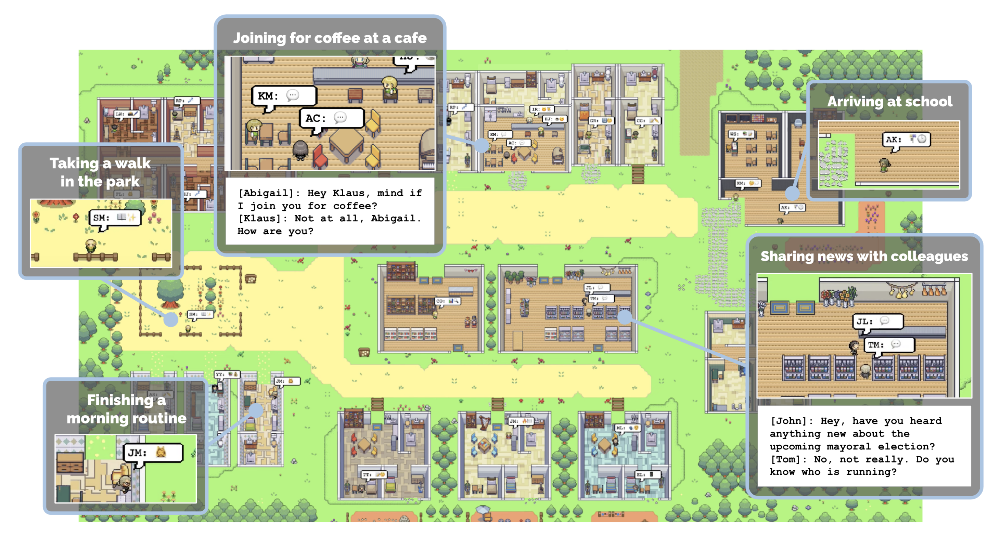

# Products

AI Agents Landscape, by July 2023  [E2B](https://e2b.dev/blog/ai-agents-in-the-wild)

  

## R&D
- **XAgent**  
  Team: OpenBMB; NLP, Tsinghua University  
  [[Site](https://x-agent.net/)] 
  [[Code](https://github.com/OpenBMB/XAgent)]  
  - 
    

      
    

- **AIWaves Agents**  
  Team: OpenBMB; NLP, Tsinghua University  
  [[Site](http://www.aiwaves-agents.com/)] 
  [[Code](https://github.com/aiwaves-cn/agents)]    
  [[Paper](https://arxiv.org/abs/2309.07870)]
    - 
      

        
      

- **AgentVerse**  
  Team: OpenBMB  
  [[Site](https://github.com/OpenBMB/AgentVerse)] 
  [[Code](https://github.com/OpenBMB/AgentVerse)]  
  [[Paper](https://arxiv.org/abs/2308.10848)]
    - 
     

       
     

- **CoALA** `Code Not Released`  
  Team: OpenBMB; NLP, Tsinghua University  
  [[Code](https://github.com/ysymyth/awesome-language-agents)]  
  [[Paper](https://arxiv.org/abs/2309.02427)]
  - 提出一种基于认知架构的语言智能体的概念框架，将大型语言模型与生产系统进行类比，系统化地组织了LLM的推理、基础、学习和决策等方法。
    - 
   

     
   

- **GPT Researcher** 
  [[Site](https://app.tavily.com/)] 
  [[Code](https://github.com/assafelovic/gpt-researcher)]  
  - 
  

   
  

- **ChatDev** 
  [[Code](https://github.com/OpenBMB/ChatDev)]  
  [[Paper](https://arxiv.org/abs/2307.07924)]
- **AgentSims** 
  [[Site](https://www.agentsims.com/)] 
  [[Code](https://github.com/py499372727/AgentSims)]  
  -
  

   
   

- **Lagent** 
  [[Code](https://github.com/InternLM/lagent)]  
  -
  

    
  

- **WebArena** 
  [[Site](https://webarena.dev/)] 
  [[Code](https://github.com/web-arena-x/webarena)]  
- **AI Town** 
  [[Site](https://www.convex.dev/ai-town)] 
  [[Code](https://github.com/a16z-infra/ai-town)]  
  AI Town is a virtual town where AI characters live, chat and socialize. 
    - based on Stanford generative agents project
    - **Analysis:**
      - [斯坦福小镇二创，8个智能体生活交友，猫猫小镇AI Town人人可搭](https://baijiahao.baidu.com/s?id=1774365864057414257&wfr=spider&for=pc) by 新智元 · Aug 16, 2023

- [BabyAGI](https://github.com/yoheinakajima/babyagi)
  
   - [Github](https://github.com/yoheinakajima/babyagi)  
   - paper: [Task-driven Autonomous Agent Utilizing GPT-4, Pinecone, and LangChain for Diverse Applications](https://yoheinakajima.com/task-driven-autonomous-agent-utilizing-gpt-4-pinecone-and-langchain-for-diverse-applications/)
- [Langchain](https://github.com/hwchase17/langchain)
  
   - [Github](https://github.com/hwchase17/langchain)  
   - **Analysis:**
     - [框架阅读：langchain精读](https://deepwisdom.feishu.cn/wiki/wikcnhYysy7aaewetJ2sUlZMbeh) by MetaGPT team · May 8, 2023
- [Auto-GPT](https://github.com/Significant-Gravitas/Auto-GPT)
   - [Github](https://github.com/Significant-Gravitas/Auto-GPT)  
- [MetaGPT](https://github.com/geekan/MetaGPT)
   - [Github](https://github.com/geekan/MetaGPT)  
   - Assign different roles to GPTs to form a collaborative software entity for complex tasks.
   - MetaGPT takes a one line requirement as input and outputs user stories / competitive analysis / requirements / data structures / APIs / documents, etc.
   - **Introduction Videos:**
     - [MetaGPT作者深度解析直播回放](https://www.bilibili.com/video/BV1Ru411V7XL)
     - [How To Install MetaGPT - Build A Startup With One Prompt!!](https://www.youtube.com/watch?v=uT75J_KG_aY)
   - [Demo Video](https://github.com/geekan/MetaGPT/assets/2707039/5e8c1062-8c35-440f-bb20-2b0320f8d27d)
- [AgentGPT](https://agentgpt.reworkd.ai/)
   - [Github](https://github.com/reworkd/AgentGPT)  
   - Allowing user to configure and deploy Autonomous AI agents. Name users' own custom AI and have it embark on any goal imaginable. It will attempt to reach the goal by thinking of tasks to do, executing them, and learning from the results
- [Generative Agents](https://github.com/joonspk-research/generative_agents)
   - [Github](https://github.com/joonspk-research/generative_agents)  
   - 

   
   

## Business Product
- **AutoGen**  
  Team: Microsoft  
  [[Site](https://microsoft.github.io/autogen/)] 
  [[Code](https://github.com/microsoft/autogen)] 

- [AI Agent](https://aiagent.app/) is a flexible app that lets user create their own agents, by setting a name with an objective.
- [SuperAGI](https://superagi.com/)
   - [Github](https://github.com/TransformerOptimus/SuperAGI)  
   - **Analysis:**
     - [框架速度：SuperAGI](https://deepwisdom.feishu.cn/wiki/RlcCwJENIiC0YNkiu6Dcc9Ornlb) by MetaGPT team · Jun 5, 2023
   - [Demo Video](https://github.com/Akki-jain/test/assets/92881074/bb18407a-b6b2-4a9f-9419-ec73ffacd2f8)

- [Council](https://www.chainml.net/council)
   - [Github](https://github.com/chain-ml/council)  
	- 

   		
   	
